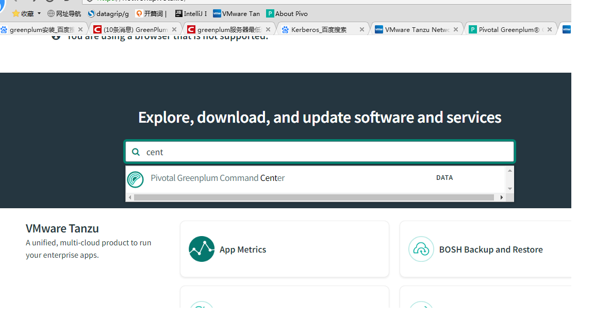
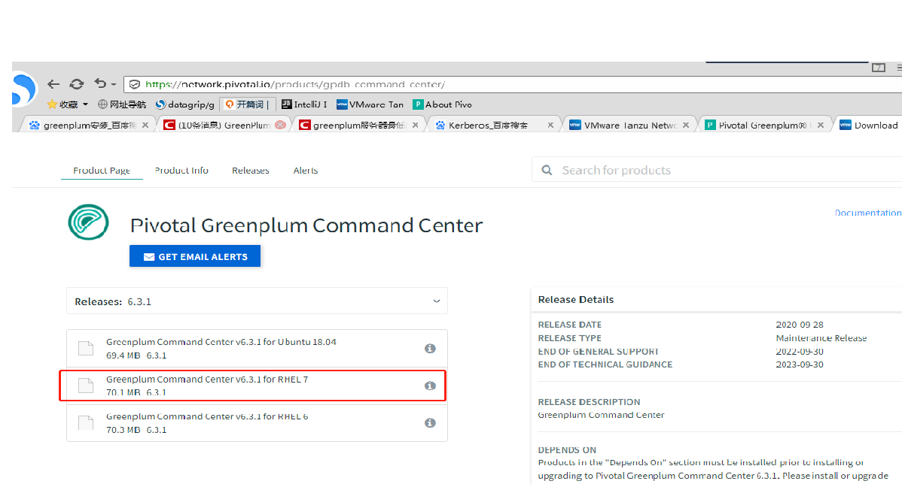

# gpcc引言
GPCC功能点, 在官方稳定GPDB611Docs.pdf 第五章 580页介绍如下
可以pg_hba.conf
4层用户权限控制
从5个地方“拿数”：OS级，DB级，gpperfmon，catalog表，query，workload man
使用UDP协议 
使用gpsmon进程搜集系统监控信息，每隔15秒，主节点发送指令来搜集
由3种表组成：now , history, tail tables
gpperfmon_install创建gpperfmon database
3种情况发起查询统计：1.提交查询 2.查询状态变更 3.查询节点开始，变更，结束
可以看哪个锁了
gp_enable_query_metrics = on 并且重启集群！
从表pg_catalog数据库的gp_segment_configuration表中提取segments的列表

# gpcc安装
帮助文档：https://gpcc.docs.pivotal.io/630/welcome.html
安装包下载到官网：https://network.pivotal.io/products/pivotal-gpdb

 

搜索command center，点击下载，rhel7  
首先要注册用户 
选择安装包：greenplum-cc-web-6.3.1-gp6-rhel7-x86_64.zip 

# gpcc使用指引（暂缺）
