- [一、前言](#一前言)
  - [gpcc特性总览](#gpcc特性总览)
  - [帮助文档](#帮助文档)
- [二、gpcc安装步骤](#二gpcc安装步骤)
  - [0. 安装先决条件](#0-安装先决条件)
  - [1. 下载安装包](#1-下载安装包)
  - [2. 上传安装包](#2-上传安装包)
  - [3. 创建安装路径](#3-创建安装路径)
  - [4. 运行安装程序](#4-运行安装程序)
  - [5. 更新/安装 Metrics Collector Extension](#5-更新安装-metrics-collector-extension)
  - [6. 启动gpcc](#6-启动gpcc)
  - [7. 安装中可能遇到的问题](#7-安装中可能遇到的问题)
- [三、gpcc使用手册](#三gpcc使用手册)
  - [1. 系统监控功能](#1-系统监控功能)
  - [2. 查询监控功能](#2-查询监控功能)
  - [3. 系统告警](#3-系统告警)
  - [4. 资源组管理](#4-资源组管理)
  - [5. 表信息查询](#5-表信息查询)
<br>

# 一、前言
> Pivotal Greenplum Command Center（以下简称gpcc）是为Greenplum大数据平台开发的数据库监控管理工具，可以从各个度量监控gp系统运行健康程度，也可以为DBA们提供简单的gp集群管理手段。

下图为gpcc的bs体系结构：
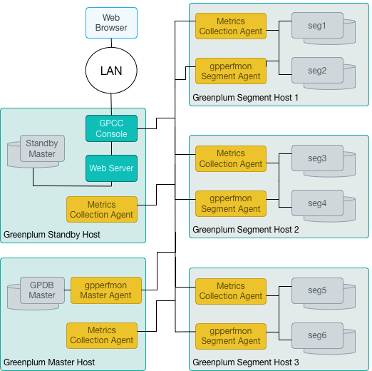


## gpcc特性总览
- gpcc直接使用gp的认证与权限控制，通过直接操作pg_hba.conf文件来实现gp的权限控制
- 提供4个gpcc独有的用户权限来实现gpcc中菜单权限和操作权限的精分
- 从5个地方“拿数”：OS，gp catalogs，Metrics Collector Extension，gpperfmon，Resource Group/queue
- 每隔15s，由主节点发送指令，实时搜集系统监控信息
- gpcc专用数据库gpperfmon由gpperfmon_install程序创建，里面由3种表组成：now, history, tail
- 主要功能点：
  - 监控Greenplum数据库性能
  - 监控数据库查询
  - 设计&推送系统性能告警
  - 管理资源组，实时分配资源
  - 表信息等其他信息的查询统计


## 帮助文档
https://tanzu.vmware.com/support   
https://gpcc.docs.pivotal.io/630/topics/overview.html   

</br>

# 二、gpcc安装步骤
## 0. 安装先决条件
- gp集群必须安装且正常运行
- 必须设置MASTER_DATA_DIRECTORY环境变量
- gpcc的安装目录（默认/usr/local）在gp所有节点都有gpadmin用户的读写权
- mdw&smdw必须开放端口28080（BS模式访问端口，可以更改）
- 所有sdwN节点必须开放8899端口（RPC远程调用接口）
- 所有节点必须安装 Apache Portable Runtime Utility library 类库   
  使用 ``` yum install apr-util 或 apt install libapr1 ``` 安装
- 配置SSL秘钥（非必须）

## 1. 下载安装包
下载到官网：https://network.pivotal.io/products/pivotal-gpdb   

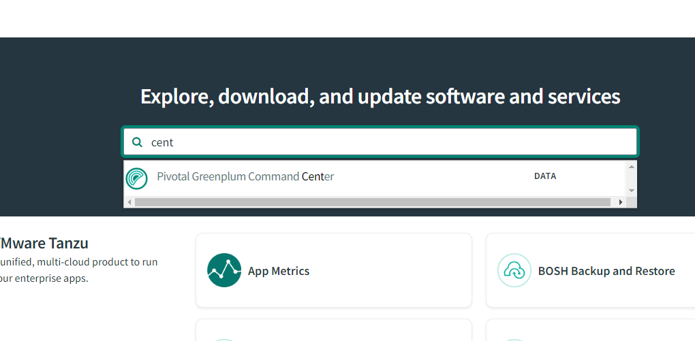

</br>

搜索 `"command center"`，按照对应的os版本下载   
查看os发行版本`cat /etc/redhat-release`   
下载前必须要注册用户！   
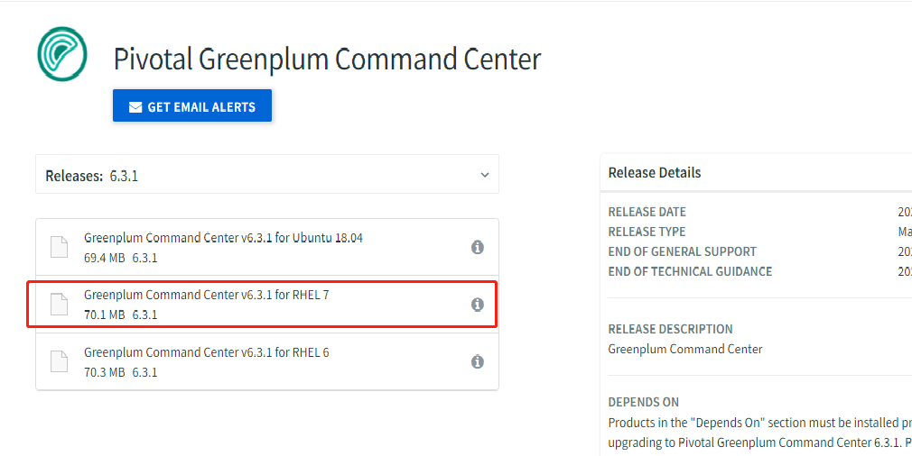


</br>

## 2. 上传安装包
上传greenplum-cc-web-6.3.1-gp6-rhel7-x86_64.zip 到mdw或smdw服务器中 gpadmin 用户的/home目录下，解压缩
```shell
$ unzip greenplum-cc-web-gp6-<version>-<platform>.zip
```
</br>

## 3. 创建安装路径
> 要求在gp所有节点操作；或者使用gpssh命令操作所有节点，其中hostfile为gp的host集群配置文件，每个ip独占一行
```shell
$ source /usr/local/greenplum-db-<version>/greenplum_path.sh
$ gpssh -f <hostfile> 'sudo mkdir -p /usr/local/greenplum-cc-6.3.0'
$ gpssh -f <hostfile> 'sudo chown -R gpadmin:gpadmin /usr/local/greenplum-cc-6.3.0'
$ gpssh -f <hostfile> 'sudo ln -s /usr/local/greenplum-cc-6.3.0 /usr/local/greenplum-cc'
```

</br>

## 4. 运行安装程序
gpcc总共四种安装方式：
- 交互式安装
- 静默安装，使用参数文件
- 默认方式安装 --auto
- 更新gpcc

```shell
# 使用“交互式”安装程序：
$ source /usr/local/greenplum-db/greenplum_path.sh
$ cd greenplum-cc-<version>
$ ./gpccinstall-<version> -W
```
注意：
- 根据安装程序提示，逐步继续即可完成安装。   
- 使用gpcc需要超级用户gpmon。若原来没有，那么gpcc安装程序会自动创建这个用户，但是密码需要新输入一遍，安装过程会有提示使用 -W 参数，首次输入一定要记住密码！

</br>

## 5. 更新/安装 Metrics Collector Extension
> 如果安装的gpcc版本比它支持的gp的版本更高，则在gpcc安装之后需要更新metrics_collector这个扩展功能。   
> 即删除旧的metrics_collector，安装新的，并重启gp   
> 如果想用gpcc新版本的特性则必须安装新版本metrics_collector，如果不想用新特性可以使用旧的。

安装方法：直接运行gpcc解压包中/MetricsCollector文件夹中的安装脚本即可！脚本都是解压好的，选择对应的版本直接执行。


</br>

## 6. 启动gpcc
```shell
# 安装完成重启gp:
$ gpstop -a , gpstart -a

# 启动gpcc： 
$ gpcc start
```

**gpcc登录地址：http://[master_ip or standby_master_ip]:28080/login**

</br>

## 7. 安装中可能遇到的问题
- 安装前gpmon用户没有提前创建：
  - 使用默认安装方式(-auto)会自动创建gpmon用户，但是需要指定密码
  - 用这种方式安装的gpcc使用时需要加 -W 参数输入密码，如$ gpcc start -W
  - 如果gpsmon已经创建不要建-W密码
- resource group启动：
  ```
  # 变更资源管理方式为资源组：
  $ gpconfig -c gp_resource_manager -v "group"
  $ gpstop -ar

  # 查看资源管理方式：
  $ gpconfig -s gp_resource_manager
  ```
- gpmon 和 gpadmin 用户不能登录到gpcc
  - 原因是gpmon和gpadmin两个用户属于superuser，superuser创建时默认的登录方式都是trust
  - 解决方法：修改 pg_hda.conf把gpmon用户所有的trust方式改成md5   
    ``` host   all   gpmon   <IP_of_host>/32   md5 ```
    - 使配置文件生效：gpstop -u 
    - 重启gpcc：gpcc start -W
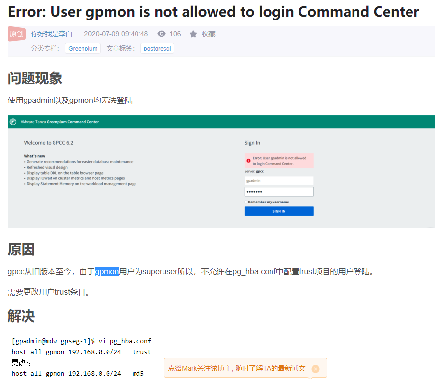

<br>

# 三、gpcc使用手册
## 1. 系统监控功能
- Dashboard
  - 系统总览，鼠标点击不同区域会跳转到对应页面
  - Database State的几种状态：Normal,Segment(s) Down,Standby Down,Standby Not Syncing,Database Unreachable,Unbalanced,Resyncing
  - Segment Status的状态：Up / Down
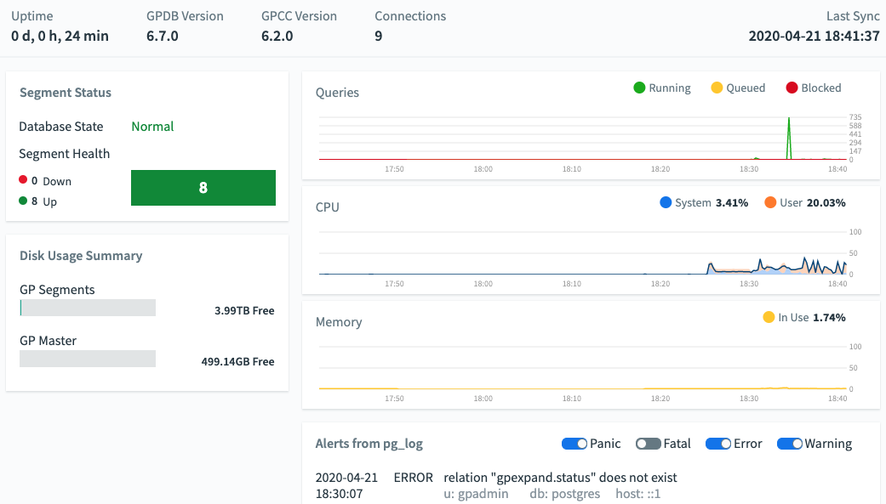

- Cluster Metrics
  - 统计范围是所有host节点，mdw&mdw不包含在内
  - 纵坐标中直线为平均值，图形为(累加)最大值；横坐标为时间，最右端为当前时间
  - CPU图表中不包含CPU等待IO所消耗的时间
  - Memory图表中不包含Buffer和Cache
  - Load图表为linux系统中的Load average，即对当前CPU工作量的度量，数值1~5为较健康的区间
  - **Swap图表为交换区使用率，在数据库中要尤其警惕！**
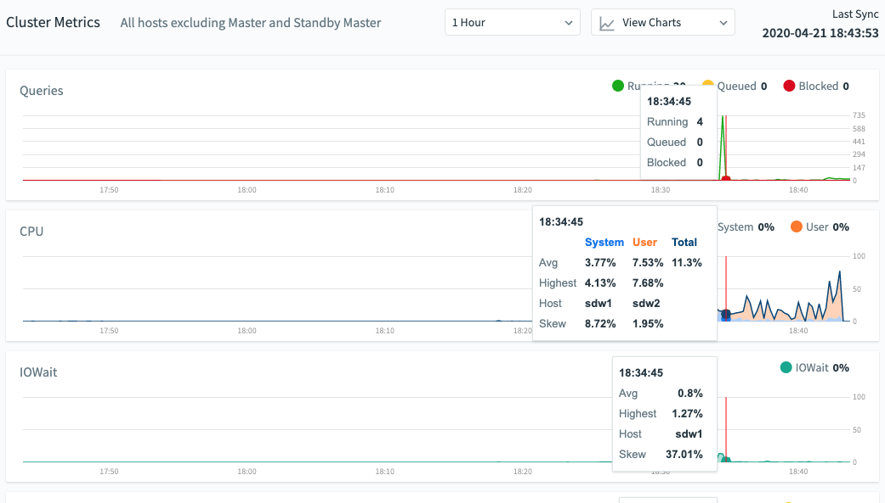

- Host Metrics
  - Skew的四种状态：Low/Moderate/High/Very High，**其中Very High需要警惕！**
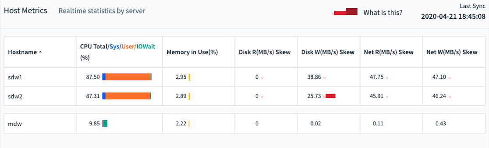

- Segment Status
  - Replication Mode: 主副节点的同步状态，"Synced"为正常
  - Preferred Role: 段主机是否运行在它应该运行的角色。比如主节点掉线之后，作为副节点的段主机接替它成为主节点，此时此副节点的状态为"Not Preferred"
  - ContentID: 从0开始，主副节点相同，mdw&mdw不包含在内

- Recommendations
  - 从Bloat，Accuracy，Skew三个维度，对数据库表提出**推荐运维操作**
  - 只统计非空的表，不统计视图和外部表
  - 扫描只在规定的时间段进行，优先扫描没有被扫过或者近期有大量update操作的表
  - 如果规定时间内没有扫描完，下一次扫描会从上一次的断点继续
  - Bloat:
    - 定义：有频繁DML操作，需要进行vacuum/vacuum-full操作的表
    - 公式：Bloat Space = unused space + dead space
    - 当Bloat比例 > 10%时，建议为Vacuum
    - 当比例 > 50%时，建议为Vacuum-full
    - 如果表近期没有DML操作，则gpcc会更倾向于Vacuum
    - 在gpcc中分别由参数bloat_threshold和bloat_vacuum_full_threshold控制
    - 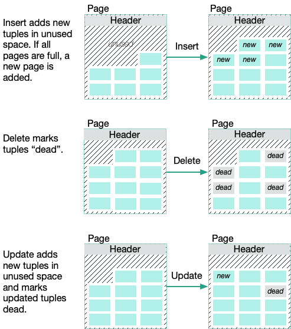
    - 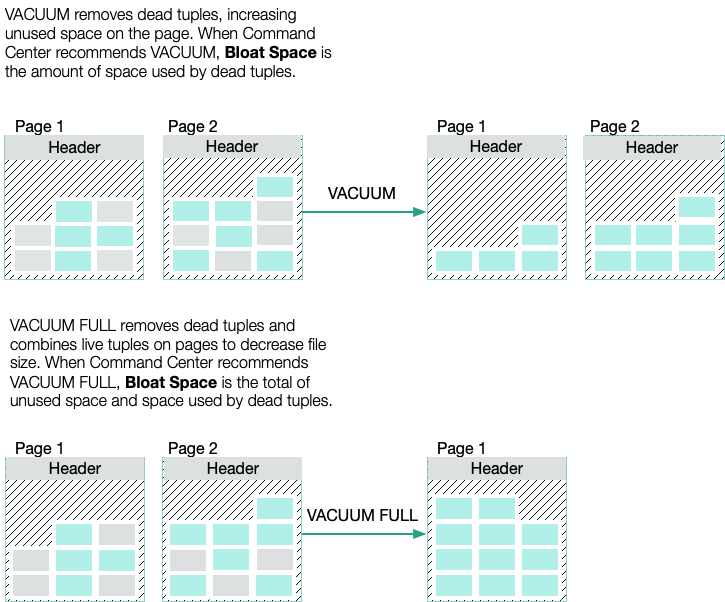
  - Accuracy:
    - 定义：统计信息已失准，需要进行analyze的表
    - 范围：统计过去30天内执行过扫描且查询过的表
    - 公式：`inaccuracy = (MAX(plan_rows, actual_rows) - MIN(plan_rows, actual_rows)) / MAX(plan_rows, actual_rows)`
    - 在统计使用过某表的所有SQL时，未使用where子句的SQL会有更高权重，Inaccuracy的计算值也更准确
    - inaccuracy > 10%才会上榜，在gpcc中由参数accuracy_threshold控制
  - Skew:
    - 定义：表示一个表数据的分布是否平均，如果过大则需要重选分部键或重分配
    - 公式：Skew% = (1 - Avg / Max) / (1 - 1/n) * 100%
    - 范围是表中数据行数为节点数128倍的表
    - 在gpcc中由参数skew_threshold和skew_tuple_per_segment控制

<br>

## 2. 查询监控功能
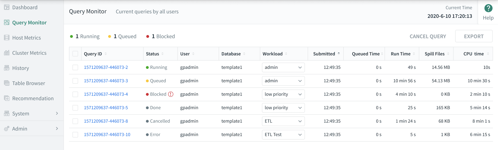
- Query ID：由`执行时间-sessionID-命令数量`组成
- Stats:
  | | |
  | -- | -- |
  | Queued | 还未执行
  | Running | 正在执行
  | Blocked | 等待锁释放
  | Done | 执行结束
  | Cancelling/Cancelled | 取消
  | Idle | 会话已打开且在等待
- 注意除了CPU Master%,CPU Segments%,CPU Skew%等指标为平均值，剩下的指标CPU Time,Memory,Spill Files都是所有段主机累计值
- Query Text：只能显示SQL的前100K字符，点击"COPY"可以下载SQL全文，但只有24h时效
- Textual Plan：同explain的功能，但若执行计划过大或包含多条语句则gpcc不会显示

<br>

## 3. 系统告警
> "Admin -> Alerts"管理员通过设定警报规则或参数阈值来实现gp系统预警。当规则触发时，gpcc会记一条记录。告警记录可以通过邮件、短信、或者脚本的方式推送给管理员。
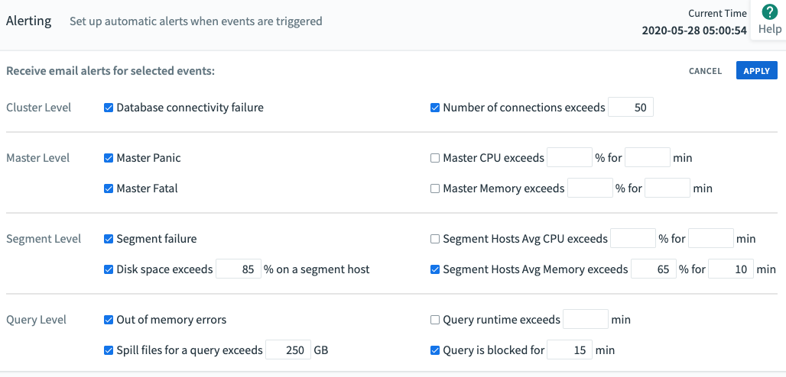

规则说明：
- Database connectivity failure：节点离线时候告警；前提是节点上的gpcc实例必须运行
- Number of connections exceeds [N]：连接总数超过N时告警，每30s检查一次，如果触发则每30m再检查一次
- Master Panic/Fatal：Panic级别的告警会使gp集群的所有session停止；Fatal级别的告警会使当前session停止（登录验证错误属于Fatal级别，但是不会触发alter）
- Master CPU exceeds [%] for [N] min：注意阈值是平均值而不是峰值
- Segment failure：segment离线则触发，触发后每30mins检查一次
- Total disk space exceeds [%] on a segment host：所有节点的平均值，而不是单一节点；规则每24h查一次
- Segment Hosts Avg CPU exceeds [%] for [N] min：所有节点的平均值；每15s取样一次
- Segment Hosts Avg Memory exceeds [%] for [N] min：同上
- Out of memory errors：OOM告警，因内存不够而等待的SQL不会触发此规则
- Spill files for a query exceeds [N] GB：因内存不够而写盘的SQL临时文件总大小超过N GB则触发；属于一次性告警
- Query runtime exceeds [N] min：一次性告警
- Query is blocked for [N] min：SQL在资源队列中等待的时间不算；一个SQL可能出现多次

<br>

## 4. 资源组管理
> gp的默认资源分配方式是Resource Queue，在安装并启用了Resource Group（以下简称rg）后才可以使用这部分功能
- Resource Groups：增加修改删除rg，并把role分配给不同的rg。对应pg_roles系统表。
- Workload Mgmt：根据不同的资源组/角色/Query标签或三者组合条件，在会话级别创建规则，通过CPU%,cost,io等指标，把不符合规则的会话停掉或迁移到其他资源组（gp6.8+)；并且记录日志！
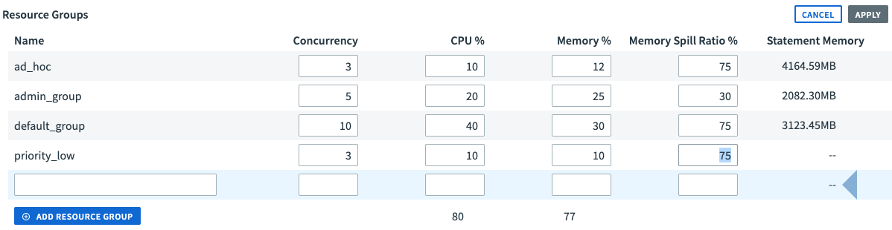

Resource Groups参数说明：
- Concurrency: rg中所有role的并发量极限，包括idle的会话！
- CPU%：对应rg中的CPU_RATE_LIMIT参数, 建议所有rg之和不要超过90%
- Memory%：对应rg中的MEMORY_LIMIT参数，建议总和不要超过100%
- Memory Spill Ratio%：对内存敏感类型的操作，如果超过这个值则会把数据向磁盘中写（如果Memory%为0，则Memory Spill Ratio%必须为0）
- Statement Memory：为每个query分配的固定内存大小，其大小由其他参数共同决定

补充说明：
- Workload Mgmt中的Planner Cost指标分为两个值，前面的值为使用GPORCA优化器的预估值，后面的值为传统Postgres Planner优化器
- Query标签是Query级别用户自定义的若干组键值对，前提是gp必须安装gp_wlm扩展包，标签设定方法：`=# SET gpcc.query_tags TO 'appName=tableau;appUser=bi_sales';`
- 所有配置在gpperfmon.gpmetrics库中可查，系统告警明细见gpcc_alert_* ，资源组配置见表gpcc_wlm_*   

<br>

## 5. 表信息查询
> "Table Brower"查看表信息，包括字段、存储类型、压缩、分部键、分区等信息，每隔5mins更新一次，并非实时统计，也非精确值！

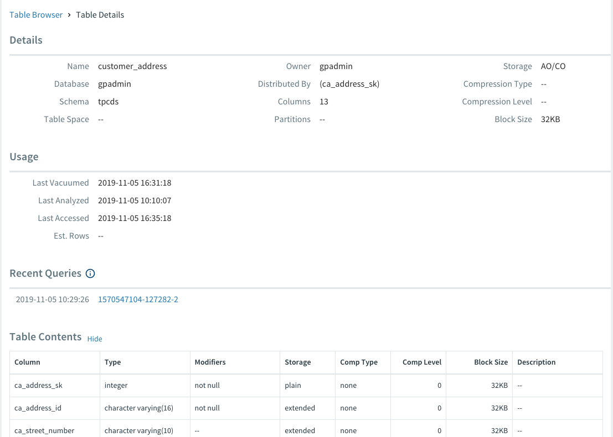

<br>
