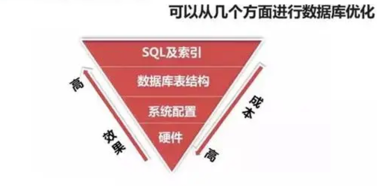

# SQL性能优化手册
 
- [SQL性能优化手册](#sql性能优化手册)
  - [引言](#引言)
  - [总体思想](#总体思想)
  - [1. 存储策略的相关优化](#1-存储策略的相关优化)
  - [2. SQL写法相关优化](#2-sql写法相关优化)
    - [2.1. 通用优化建议](#21-通用优化建议)
    - [2.2. 针对于gp的优化建议](#22-针对于gp的优化建议)
    - [2.3. SQL和SP优化建议](#23-sql和sp优化建议)
    - [2.4. 优化器相关](#24-优化器相关)
    - [2.5. 运维优化建议](#25-运维优化建议)
  - [补充知识点(待扩展)](#补充知识点待扩展)

<br>

## 引言
> SQL查询效率问题是数据库的主要性能指标。无论多么完美的架构设计和硬件支持，一个糟糕的SQL也能使DB性能断崖式下跌，甚至接近瘫痪。性能优化的必要性不言而喻。本文就greenplum数据库开发中遇到的各种问题，总结了对应的优化手段，希望同事在开发中加以借鉴，必要时查阅。

<br>

## 总体思想
- 选择正确的表存储策略；
- 使用正确的SQL语句降低数据库负载；
- 提升集群的并发度，充分发挥MPP数据库的优势！

<br>

优化方法：


<br>

DB性能优化大致可以从四个方面考虑：
| 优化手段 | 实施成本 | 实施人员 |
| --- | --- | --- |
| 表设计、模型设计、存储引擎 | 低 | 开发人员 |
| SQL写法、索引策略、优化器选择 | 低 | 开发人员 |
| DB软件、版本、参数设置 | 高 | 数据库管理人员 |
| OS系统硬件、存储介质、网络拓扑 | 高 | 数据库管理人员 |
|




针对开发人员的工作内容，下面从表设计和SQL写法两个方面主要阐述。

<br>


## 1. 存储策略的相关优化
- 为什么采用AO表?
  - MPP属于IO密集型系统，主要性能瓶颈在磁盘IO
  - 使用场景多用于OLAP或准实时系统，对于事务支持依赖度低，强调IO、分区和并行
  - 当数据量超过100万时建议使用AO表
  - 综合以上特点，没有特殊情况时MPP数据库统一使用AO表`appendonly = true`
- 为什么**不**采用列存储?
  - 总体方法是一个文件只存一个列的值，不同列的值不会同时出现一个文件中
  - 列存储适用于有很多字段的“大宽表”
  - 压缩率：列存储 ≥ 行存储，所以列存储加载更快
  - 一般只查询“大宽表”中的很少一部分字段
  - 因为以上场景使用较少，并且列存储的表使用分区后会使文件数会成倍增加，所以现阶段要慎用列存错(Physical files = Segments * Columns * Partitions)
- 什么表采用广播 `distributed replicated`?
  - 数据量小但是会经常使用到的表（例如代码表、参数表、维度表等等）
  - 由于广播的时间和空间成本相对较小，所以把这些“小表”做广播 
  - 典型的有期货品种、期权品种、交易日历等等
- 分布键：
  - 只用一个字段做分布键
  - 有极少的空值，否则会造成数据过度冗余
  - 有较强的区分度，否则基数过小会使数据倾斜严重
  - 有较重要的业务含义，经常作为关联条件`join`
  - 分布均匀，避免倾斜
- 分区键：
  - 适度的使用分区表
  - 分区键和分布键**不能相同**
  - 分区个数不要超过OS最大文件个数限制
  - 列存储的表不要使用分区，否则文件数会完全失控
  - 有较强的业务区分度，经常作为筛选条件`where`
  - 仅当在根据查询条件可以实现分区裁剪时使用分区表<>分区的目的是尽可能的缩小SQL需要扫描的数据量，因此必须和查询条件相关联。
  - 尽量少地创建分区，每个分区的数据尽量多些
- 分区类型：
  - 分为三种：年、月、日
  - 分区名分别为：`p_y_yyyymmdd、p_m_yyyymmdd、p_d_yyyymmdd`
  - 大体上本着一个文件不超过100M为原则<br>用100M为分水岭来算得分区类型
  - 建议优先使用范围range分区，否则使用列表list分区
- 表压缩：
  - 使用压缩表的目的是大大节约存储成本
  - 压缩等级等级1~19（gp版本6.0以上）,<br>理论上压缩级别越高压缩比越高，但是压缩和解压时的CPU消耗也越大
  - 实验中采用折中方案，`compresslevel = 10 ` 的时候压缩比大概为20%<br>再提高压缩比时速度和压缩率没有明显提升
  - 压缩格式统一选择 `compresstype = zstd`
- 经常使用 vacuum 或 vacuum full
  - vacuum只是简单回收空间，会把由于delete和update操作造成的空洞重复利用，但是不会释放空间。而vacuum full则会释放相应的空间，并归还给OS。
  - vacuum full 会加表级排它锁且占用较长时间，所以应选择非忙的时间使用。

<br>

## 2. SQL写法相关优化
### 2.1. 通用优化建议
- select列表不需要的字段不要取；尽量不用select *
- select列表必须使用`表别名.字段名`的形式
- 尽量使用where过滤条件；尽量不用having来过滤
- 尽量使用union all；尽量不用union（如果不需要排序的话）
- 如果只需要去重不需要排序，可以先使用union all再group by，来替代union
- 尽量使用group by；尽量不用distinct
- 尽量使用exists；尽量不用in (subquery)
- 尽量使用索引列；尽量不要在索引列上使用函数，这样会使索引失效
- 尽量使用=、>=、<=、；尽量不用<、>、<>、!=、not、not in、not like<br>假设num字段为整形且有索引，则where num >=6 的效率要优于 where num > 5
- 尽量减少查询的次数
```sql

--例子1：
select col1 from table1 t1 where id = 123
union all
selct col1 from talbe1 t1 where id = 456
/*下面SQL要优于上面*/
select col1 from table1 t1 where in （123, 456);

--例子2：
select c1, c2 from table2 t1 where c1 = 1 and c2 = 2
 union all
select c2, c3 from table2 t2 where c2 = 2 and c3 = 3
/*下面SQL要优于上面*/
  with w_table2 as (
                       select c1, c2, c3 
                         from table2 t 
                        where c1 =1 
                          and (c2 = 2 or c3 = 3)
                   )
select c1, c2 from w_table2 t1 where c2 = 2
 union all
select c2, c3 from w_table2 t2 where c3 = 3                   
```
- 尽量减少子查询的次数
```sql
select col1 from table1 t
 where tab_name = (select c.tab_name from tab_columns c where c.version = 123)
  and db_ver = (select c.version from tab_columns c where c.version = 123)
/*下面SQL要优于上面*/
select col1 from table1 t
 where (tab_name, db_ver) in (select c.tab_name,c.version from tab_columns c where c.version = 123);
```


### 2.2. 针对于gp的优化建议
- 减小查询返回行数
  - 尽量使用 where 条件缩小结果集的数据量
  - left join 表的时间条件要写“数值”，而不是用关联条件
  - 先关联“小表”，再关联“大表”
- 减少数据库访问次数
  - union all 转换成 with子句
- 降低GP集群负载
  - 关联多个表时，相同分布键的表“放一起”关联
  - 尽量避免使用去重distinct、排序order by
  - 尽量避免重定向、广播
  - 尽量避免广播大表
- 定义函数时使用正确的稳定级别
  - 函数稳定级别的设计初衷是为了防止数据的不一致性
  - volatile(默认)：每行记录都**必须**执行一次
  - stable：表示该函数不能修改数据库，并且对于相同的参数值，它在一次表扫描中将返回相同的结果；在sql时执行函数
  - immutable：表示该函数不能修改数据库并且对于给定的参数值总是会返回相同的值；在sql生成执行计划的时候执行函数
  - 稳定性：immutable > stable > volatile
- 查询分区表时：
  - where条件中只有使用=, < , <= , >, >= , and <>等操作符，才会自动选择分区
  - 在使用STABLE and IMMUTABLE函数时，才会"走分区"；若where中使用函数或者volatile函数则不会走分区

### 2.3. SQL和SP优化建议
- 注意默认情况下，在函数中所有数据操作`INSERT，UPDATE、DELETE、TRUNCATE`等都是包含**在一个事务**当中，如果函数执行出错，所有操作将会回滚
- gp的窗口函数比常规聚合函数要慢很多，如果SQL中必须使用开窗函数，则要尽可能的推向外层。**因为越向外，结果集越小，窗口函数的代价就会降低。**
- 判断记录是否存在，应使用 `LIMIT 1` 子句的方式，不要使用`SELECT COUNT(*)`语句
- 尽量使用group by去重，不要用partition by ...，有时候会有sort
- 用户自定义函数：
  - 尽量采用immutable 类型，避免volatile(默认)类型，对于后者，应尽量避免频繁调用
  - 尽量使用plpgsql语言开发。当plpgsql无法实现所需功能时，再考虑使用plpython、pljava等开发语言。但不建议使用C语言开发（不是说C语言不好），原因是容易因代码缺陷或不够优化，影响服务器的稳定运行。
  - 鼓励使用`RAISE NOTICE`语句输出函数执行信息，便于在发生错误时辅助诊断出错原因，但要注意日志打印不要过量。例如`raise notice 'this is raise demo , param1 is % , param2 is %',param1, param2;` 
- 不建议显式`lock`某张表，尤其是公共数据表，因为该锁会一直持有到函数执行结束，在此期间，其他用户将无法访问该表
- 插入大量数据前，建议关闭 **gp_autostatS_mode**，即 `set gp_autostats_mode = none` ,数据插入后，再改回或执行**Analyze**收集统计信息；例如：
  ```sql
  --关闭收集统计信息（会话级）
  set gp_autostats_mode=none;

  --开始插入大量数据
  insert into table_name select * from table_old;

  --收集统计信息
  set gp_autostats_mode=on_no_stats; --on_no_stats是默认项
  或
  analyze table_new;
  ```
- 表通过分布键关联时，不要使用表达式字段的方式进行关联，否则会导致数据重分布；**实时上分部键/分区键上最好什么函数都不要用！**
- 多表关联的时候尽量避免大表和大表先关联，除非**过滤性**非常强。
- 尽量将嵌套子查询转换为外连接方式实现，以减少嵌套层数
- 对Not IN ，Not Exist 操作，建议使用LEFT JOIN 的方式实现，并且使用DK作为关联条件，避免broadcast


### 2.4. 优化器相关
- 优化器可以在session级别打开和关闭，打开操作：`set optimizer=on;`
- GPORCA：
  - 适合的场景：
    - （1）多张分区表关联的SQL（要及时收集rootpartition统计信息）
    - （2）关联（join）个数较多的SQL
    - （3）嵌套子查询较多的SQL
    - （4）window函数较多的SQL
  - 不台合适的场景：
    - （1）系统表的查询
    - （2）简单的SQL
    - （3）要求响应速度很快的SQL查询


### 2.5. 运维优化建议
- 建议定期运维pg_catalog下的系统表
- 对大数据表进行了大规模的DML操作之后，应该进行analyze操作，重新收集统计信息
- analyze大表时，建议只收集分部键，关联字段和过滤字段的统计信息，避免analyze全表时间过长，如analyze table_name(col_name1,col_name2,...);
- 系统表建议定期vacuum analyze。尽量避免频繁的建表、删除表操作，因为这样会导致系统元数据表的膨胀，系统性能会整体下降。


<br>

 --- 
## 补充知识点(待扩展)
- Greenplum的Share-nothing架构的特点
  - SQL在share-nothing架构下是如何执行的：解析、分发、组装、返回结果


<br>

- 重定向 & 广播 & 分片(slice) <br>
  有几个motion就决定最后几个片<br>Slice数 = Slice0 + Motion数 = Slice0 + BC/RD Motion * 切片次数 + Gather Motion


<br>

- 执行计划怎么看 (参考官方文档446页)     
  - cost怎么看：cost=页数, rows=估计行数，width=每一行的宽度
  - actual time怎么看: rows=实际行数，loop=？

<br>

- datagrip查看执行计划的几种方法：
  - explain、explain (raw)、explain analyze、explain analyze (raw)
  - compare with

<br>

- left join 关联时主表不能被广播

<br>

- GP操作效率对比
  
  | 较快的操作 | 较慢的操作 |
  | --- | --- |
  | Sequential | |
  | Hash Join | Nested Loop 和 Merge Join |
  | Hash Aggregate | Sort |
  | Redistribute Motion | Broadcast Motion |
  | Hash Aggregate | Group Aggregate |

<br>

- alter table 修改表的速度相关<br>
  下表中说明了alter table时对不同存储类型的影响，其中Heap为堆表，AORO为行级AO表，AOCO为列级堆表；YES 代表需要重写表，NO代表不需要重写表：<br>

  | 操作 | Heap | AORO |  AOCO |     
  | ---| ---| ---| ---|
  | ADD COLUMN | NO | YES | NO |     
  | DROP COLUMN | NO | NO | NO |     
  | ALTER COLUMN TYPE | YES| YES | YES |     
  | ADD COLUMN DEFAULT NULL | YES | YES | NO |     
  | ADDCOLUMN DEFAULT  | VALUE | YES | YES | NO |

<br>

- vacuum 与 vacuum full的区别

|		|	无VACUUM	|	VACUUM	|	VACUUM FULL	|
|	 --- 	|	 --- 	|	 --- 	|	 --- 	|
|	删除大量数据之后	|	只是将删除数据的状态置为已删除，该空间不能记录被重新使用。	|	如果删除的记录位于表的末端，其所占用的空间将会被物理释放并归还操作系统。如果不是末端数据，该命令会将指定表或索引中被删除数据所占用空间重新置为可用状态，那么在今后有新数据插入时，将优先使用该空间，直到所有被重用的空间用完时，再考虑使用新增的磁盘页面。	|	不论被删除的数据是否处于数据表的末端，这些数据所占用的空间都将被物理的释放并归还于操作系统。之后再有新数据插入时，将分配新的磁盘页面以供使用。	|
|	执行效率	|		|	由于只是状态置为操作，因此效率较高。	|	在当前版本的PostgreSQL(v9.1)中，该命令会为指定的表或索引重新生成一个数据文件，并将原有文件中可用的数据导入到新文件中，之后再删除原来的数据文件。因此在导入过程中，要求当前磁盘有更多的空间可用于此操作。由此可见，该命令的执行效率相对较低。	|
|	被删除的数据所占用的物理空间是否被重新规划给操作系统。	|	不会	|	不会	|	会	|
|	在执行VACUUM命令时，是否可以并发执行针对该表的其他操作。	|		|	由于该操作是共享锁，因此可以与其他操作并行进行。	|	由于该操作需要在指定的表上应用排它锁，因此在执行该操作期间，任何基于该表的操作都将被挂起，知道该操作完成。	|
|	推荐使用方式	|	在进行数据清空时，可以使用truncate操作，因为该操作将会物理的清空数据表，并将其所占用的空间直接归还于操作系统。	|	为了保证数据表的磁盘页面数量能够保持在一个相对稳定值，可以定期执行该操作，如每天或每周中数据操作相对较少的时段。	|	考虑到该操作的开销，以及对其他错误的排斥，推荐的方式是，定期监控数据量变化较大的表，只有确认其磁盘页面占有量接近临界值时，才考虑执行一次该操作。即便如此，也需要注意尽量选择数据操作较少的时段来完成该操作。	|
|	执行后其它操作的效率	|	对于查询而言，由于存在大量的磁盘页面碎片，因此效率会逐步降低。	|	相比于不执行任何VACUUM操作，其效率更高，但是插入的效率会有所降低。	|	在执行完该操作后，所有基于该表的操作效率都会得到极大的提升。	|

